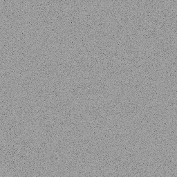
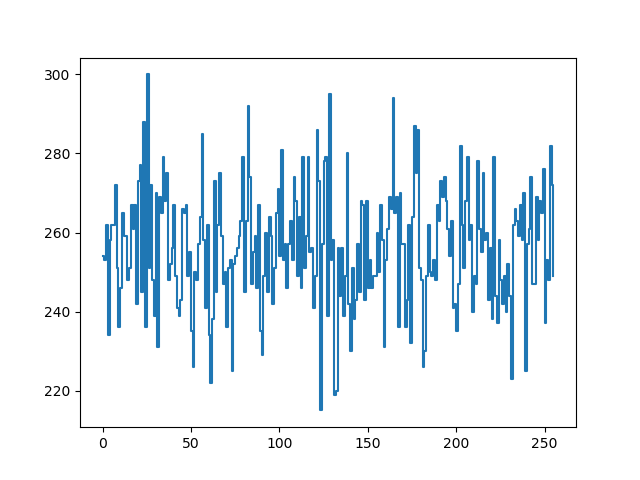
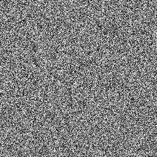

# A survey of noise functions

（※書きかけです）

## 再現環境を作る

* 再現環境を用意するためにまず画像を出力できるようにする
* 環境は Python 3.x, numpy, OpenCV を利用
  * 要するに Anaconda + OpenCV という感じ

```python
# -*- coding: utf-8 -*-

import numpy as np
import cv2


def create_image(width, height):
    # No alpha-channel
    return np.zeros([height, width, 3])


def fill_uv_color(image, width, height):
    for y in range(height):
        ry = y / (height - 1)
        for x in range(width):
            rx = x / (width - 1)
            image[y][x][0] = 255 * rx
            image[y][x][1] = 255 * ry
            image[y][x][2] = 0


def save_image(image, output_path):
    cv2.imwrite(output_path, image[:, :, [2, 1, 0]])
```

```python
# -*- coding: utf-8 -*-

import image_utils as ut


def main():
    print('A survey of noise functions')
    width = 256
    height = 256
    image = ut.create_image(width, height)
    ut.fill_uv_color(image, width, height)
    ut.save_image(image, 'test.png')


if __name__ == '__main__':
    main()
```

* 試しに出力してみた画像は以下の通り。


## 画像を分析する

* ノイズ関数を比較したいので指標が必要
* ヒストグラムを表示してどの値がどのくらい出現しているかを確認
* フーリエ変換してスペクトル解析

```python
def get_fft2_image(image):
    # Calculate 2D-FFT and shift to visualize
    fft = np.fft.fft2(image)
    fft = np.fft.fftshift(fft)

    # Level adjustment
    p = np.log10(np.absolute(fft))

    # Normalize to [0, 255]
    min = np.amax(p)
    if min > 0:
        p = p / min
    p = np.uint8(np.around(p * 255))
    return p
```

* 試しに出力してみた画像は以下の通り。
* 左が元の画像、右がその周波数成分を可視化したもの。
  * 見えやすいようにレベル補正、正規化をしているので注意





* 周波数成分の画像が概ね平坦であることから、周波数成分が均等に分布していることが読み取れる

## 乱数生成器／ハッシュ関数の比較

* 乱数生成器を利用するのはシェーダーでの並列実行に適さないことが多いので注意
* 内部状態を持つため
* 事前計算でノイズテクスチャを生成する場合は乱数生成器も利用しやすい

### random.random()

* Python 標準ライブラリの乱数生成器

```python
def random_random(uv):
    return random.random()
```


### numpy.random.rand()

* numpy の乱数生成器

```python
def numpy_random_rand(uv):
    return np.random.rand()
```


### Xorshift

* xorshift を利用した乱数生成器
* 実験用なので実装は雑

```python
xorshift_state = int(2463534242)
def xorshift(uv):
    global xorshift_state
    xorshift_state = xorshift_state ^ ((xorshift_state << 13) & 0xFFFFFFFF)
    xorshift_state = xorshift_state ^ (xorshift_state >> 17)
    xorshift_state = xorshift_state ^ ((xorshift_state << 5) & 0xFFFFFFFF)
    return float(xorshift_state) / float(4294967295.0)
```


### fract(), sin() を利用したハッシュ関数のバリエーション

* see also: https://gist.github.com/patriciogonzalezvivo/670c22f3966e662d2f83#file-glsl-noise-md

```glsl
float rand(vec2 c){
    return fract(sin(dot(c.xy ,vec2(12.9898,78.233))) * 43758.5453);
}
```

```python
def unnamed_hash_0(uv):
    offset = np.array([12.9898, 78.233])
    return fract(np.sin(np.dot(uv, offset)) * 43758.5453123)
```




```glsl
float rand(vec2 n) {
    return fract(sin(dot(n, vec2(12.9898, 4.1414))) * 43758.5453);
}
```

```python
def unnamed_hash_1(uv):
    offset = np.array([12.9898, 4.1414])
    return fract(np.sin(np.dot(uv, offset)) * 43758.5453)
```


```glsl
// <https://www.shadertoy.com/view/4dS3Wd>
// By Morgan McGuire @morgan3d, http://graphicscodex.com
float hash(vec2 p) {
    return fract(1e4 * sin(17.0 * p.x + p.y * 0.1) * (0.1 + abs(sin(p.y * 13.0 + p.x))));
}
```

```python
def unnamed_hash_2(uv):
    a = np.sin(17.0 * uv[0] + uv[1] * 0.1)
    b = (0.1 + np.abs(np.sin(uv[1] * 13.0 + uv[0])))
    return fract(1e4 * a * b)
```


